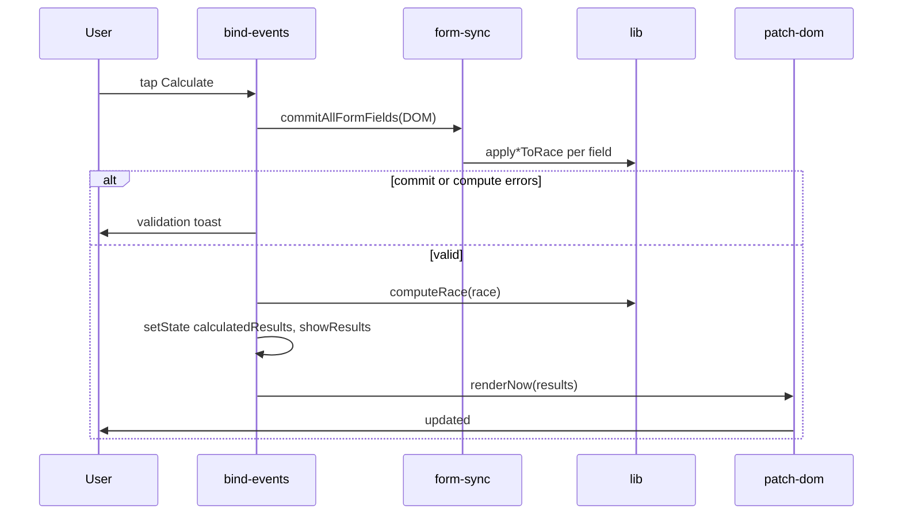

# Architecture

## Layered structure

```
┌─────────────────────────────────────────────────────────┐
│  main.ts          Bootstrap, PWA service worker         │
├─────────────────────────────────────────────────────────┤
│  app/             Application orchestration             │
│    create-app     State container, render scheduling    │
│    form-sync      DOM ↔ RaceDraft sync                  │
│    state          Initial state, undo, load/save hooks  │
│    persist-*      Debounced localStorage writes         │
├─────────────────────────────────────────────────────────┤
│  ui/              Presentation & interaction            │
│    render-*       HTML string templates                 │
│    patch-dom      Scoped DOM updates                    │
│    bind-events    Event delegation (once)               │
│    components/    Reusable button, field, toggle HTML   │
├─────────────────────────────────────────────────────────┤
│  lib/             Pure domain logic                     │
│    time           Parse/format durations & timestamps   │
│    race-state     RaceDraft model, computeRace          │
│    persist-race   Versioned localStorage validation     │
│    form-commit    Apply field values to RaceDraft       │
│    ui-helpers     Sort, escape, formatting helpers      │
└─────────────────────────────────────────────────────────┘
```

**Rule:** `lib/` must not import from `app/` or `ui/`. Domain stays testable without a DOM.

## Application bootstrap

```text
index.html
  └─ main.ts
       ├─ registerSW() (skipped under Playwright webdriver)
       └─ createApp(#app, #toast).init()
            ├─ loadPersistedState()
            ├─ bindEventsOnce()  — listeners attached once
            └─ renderNow({ type: "full" })
```

`createApp` owns a **closed-over `AppState`** and exposes actions to `bind-events.ts`:

| Action | Purpose |
|--------|---------|
| `getState` / `setState` | Read/update UI state |
| `updateRace` | Mutate `RaceDraft`, clear calculation snapshot, schedule render |
| `scheduleRender` | Coalesce DOM work into next animation frame |
| `renderNow` | Immediate patch (Calculate, copy feedback, confirm) |
| `getComputed` | Last calculated result snapshot when results visible |

## State model

Two conceptual layers:

### `RaceDraft` (`lib/race-state.ts`)

Persisted race data: start time, reference elapsed, lanes, gaps. Written to `localStorage` (debounced).

### `AppState` (`app/types.ts`)

Ephemeral UI state:

| Field | Role |
|-------|------|
| `race` | Current `RaceDraft` |
| `showResults` | Whether results section is visible |
| `calculatedResults` | Snapshot from last successful Calculate (not live draft) |
| `copiedLanes` | Checklist of lanes marked copied (not persisted) |
| `contextCollapsed` | Race context accordion |
| `confirmAction` | Active confirmation dialog (`nextRace`, `clearJudge`, `changeRef`, `removeLane`) |
| `undoSnapshot` | One-level undo after Next race / Clear judge (expires after 30 s) |
| `resultsSort` | Place vs lane ordering |

## Rendering pipeline

### Full render

On init and after major actions (Next race, undo), `{ type: "full" }` replaces `#app` inner HTML.

### Scoped render (`RenderScope`)

Most interactions patch a **slice** of the DOM via `applyRenderScope` in `ui/patch-dom.ts`:

| Scope | Patches |
|-------|---------|
| `context` | `#context-card` |
| `lanes` | `#lanes-section` |
| `lane-row` | Single `.lane-row[data-lane]` |
| `results` | `#results-card` |
| `copied-lane` | Single result card (class + button label) |
| `banners` | `#app-banners` |
| `dialog` | `#confirm-host` |
| `footer` | Body-level footer + build label |

`mergeRenderScope` coalesces multiple updates in one frame (higher priority wins). See `app/render-scope.ts`.

### Calculation snapshot

Results are **not** recomputed from the live draft after Calculate. A successful Calculate stores `calculatedResults` (`ComputedRace`); display, Copy All, and sort all read from that snapshot. Draft edits clear the snapshot via `updateRaceDraft` (sets `showResults: false`, `calculatedResults: null`).

Per-lane copy buttons and Copy All therefore always agree until the operator calculates again.

## Event binding

**One-shot delegation** in `bind-events.ts`:

- `#app` — click, input, change, blur, pointerdown (gap sign), keydown
- `document.body` — footer actions (Next race, Clear judge, Undo)

Why pointerdown for gap ±: iOS Safari consumes the first tap outside a focused input; `pointerdown` + `preventDefault` fires before blur eats the gesture.

Why body listener for footer: footer is rendered outside `#app` in `document.body`.

## Persistence

```text
typing → schedulePersistRace (400ms debounce)
Calculate / Next race / flush → flushPersistRace (immediate)
beforeunload / pagehide → flushPendingPersist
```

Draft key: `crew-timing-race-draft` in `localStorage`. Format: `{ version: 1, draft: RaceDraft }` (see [Domain & computation — Persistence](domain-and-computation.md#persistence)). Legacy unversioned drafts still load; the next save writes v1.

Stale drafts (previous calendar day) require start-time reconfirmation.

## PWA / service worker

- `registerType: "autoUpdate"` — new deploys replace cached assets when online.
- Playwright sets `navigator.webdriver`; SW registration is skipped so WebKit E2E can load reliably.
- Mobile E2E uses `serviceWorkers: "block"` in Playwright config.

## Data flow (Calculate)



## Related docs

- [Codebase guide](codebase-guide.md) — file-level map
- [Domain & computation](domain-and-computation.md) — `computeRace` detail
- [Copied lane feedback](copied-lane-feedback.md) — copy checklist UX
