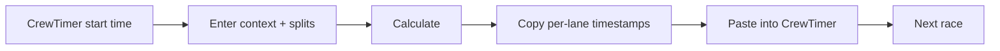

# Project overview

## What this app is

**Race Timing Calculator** is a mobile-first progressive web app (PWA) that helps finish-line operators convert judge-sheet data into **CrewTimer-ready chronological timestamps**.

Operators enter:

1. **Race start timestamp** — clock time from CrewTimer (`HH:MM:SS.SSS`).
2. **Reference elapsed** — how long the reference boat was on the water.
3. **Per-lane gaps** — how far ahead or behind each boat finished relative to the reference lane.

The app outputs, for each active lane, a **finish timestamp** to paste into CrewTimer's **Timestamp** field, plus a **calculated elapsed** cross-check against CrewTimer's **Delta Time**.

**Live site:** https://foobits.github.io/crew-timing/

## What it is not

- Not an official timing system or USRowing record.
- Not a replacement for CrewTimer — it is a calculator and data-entry aid.
- Not a backend service — entirely client-side; data persists in `localStorage` on the device.

## Primary users

Finish-line volunteers and coaches who:

- Receive paper or spreadsheet splits (reference elapsed + gaps).
- Need millisecond-precision timestamps in CrewTimer's expected format.
- Work on phones at the venue, often one-handed, sometimes offline after first load.

## Core workflow

See the root README [race-day workflow](../README.md#race-day-workflow) and [field input formats](../README.md#field-input-formats) for operator-facing detail.

## Design constraints

| Constraint | Rationale |
|------------|-----------|
| Mobile-first touch UI | Primary device at the finish line is a phone |
| Works offline (PWA) | Venue Wi‑Fi is unreliable |
| Debounced persistence | Avoid hammering `localStorage` while typing |
| Explicit **Calculate** | Operators review inputs before results; invalid input aborts; results are a snapshot until recalculated |
| Partial DOM updates | Keep typing smooth on mid-tier phones |
| 24-hour timestamps, ms precision | Match CrewTimer expectations |

## Key terminology

| Term | Meaning |
|------|---------|
| **Reference lane** | The boat whose elapsed time anchors all gaps |
| **Gap from reference** | Signed delta vs reference finish — **not** total elapsed |
| **Calculated elapsed** | Total time on water for a lane; compare to CrewTimer Delta Time |
| **Finish timestamp** | Clock time pasted into CrewTimer |

## Related docs

- [Domain & computation](domain-and-computation.md) — math and parsing rules
- [Copied lane feedback](copied-lane-feedback.md) — progress UI when copying results
